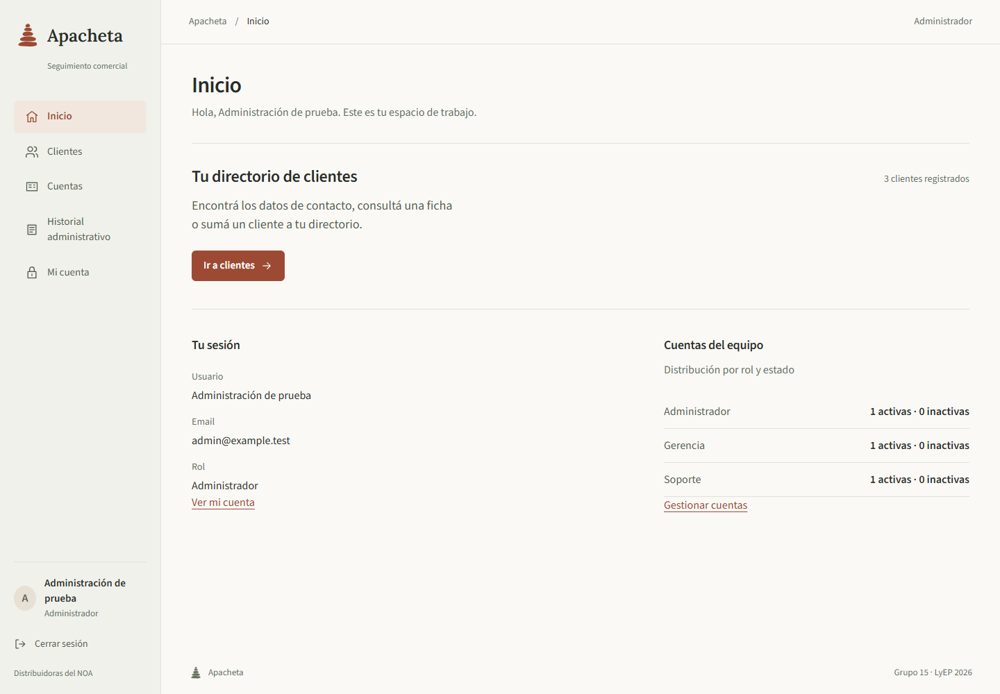
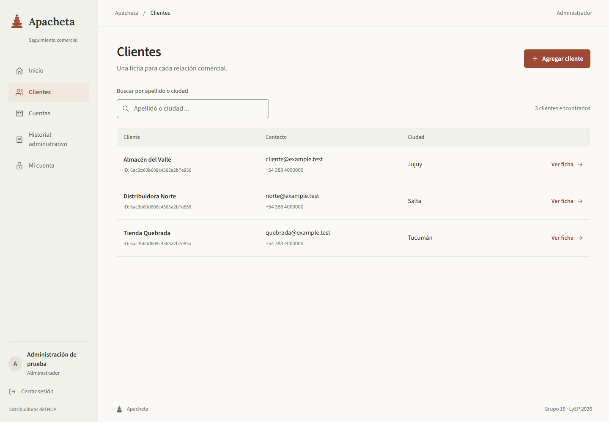
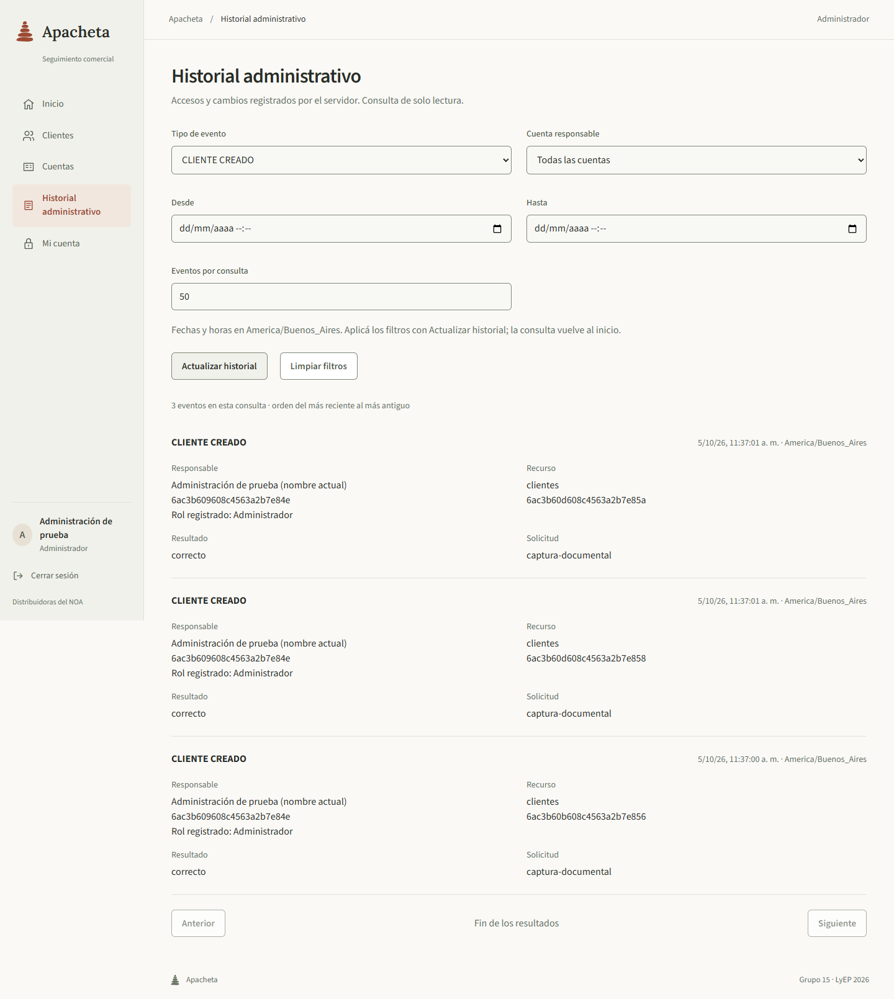
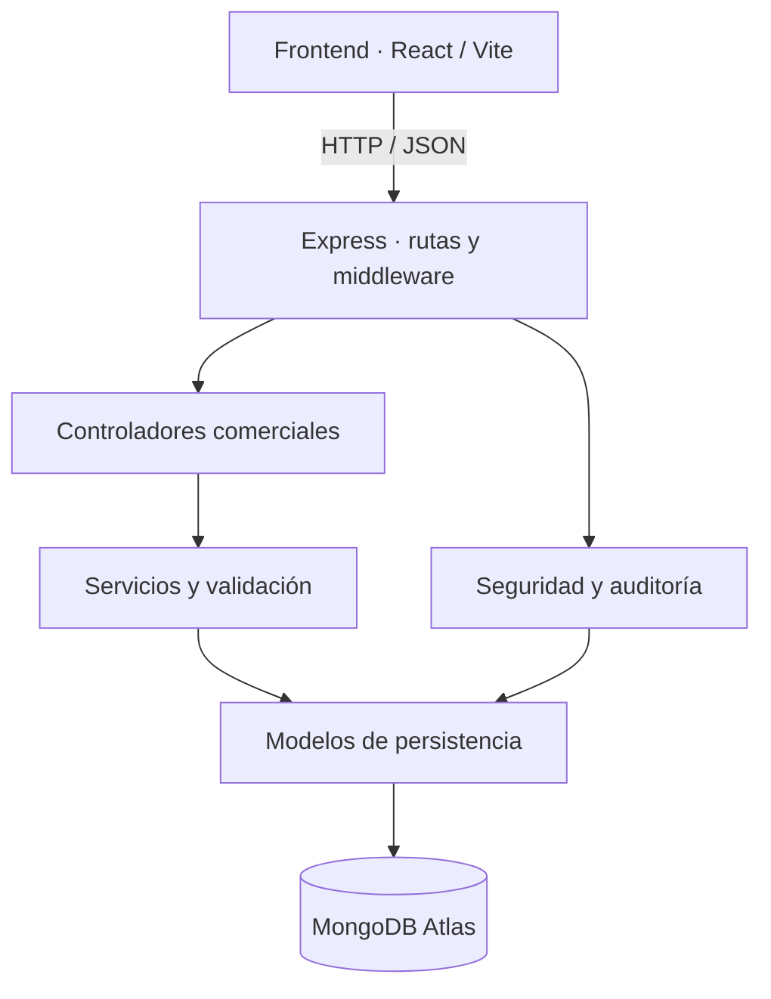

# Apacheta

**Gestión comercial con información persistente y acceso por roles.**

Grupo 15 · Legislación y Ejercicio Profesional · UNJu · TP2 2026.

Apacheta es una aplicación web para consultar y gestionar clientes de distribuidoras mayoristas del NOA. El trabajo transforma el prototipo del TP1 en un sistema integrado: reemplaza la API externa por un backend propio, conserva los datos en MongoDB Atlas e incorpora cuentas, permisos y auditoría. Mantiene el circuito comercial existente y lo presenta con una identidad visual propia.

*Inicio con perfil Administrador. Las capturas muestran la aplicación real con datos ficticios de demostración.*

## Contenido

- [Problema y propuesta](#problema-y-propuesta)
- [Resolución del trabajo](#resolución-del-trabajo)
- [Funcionalidades y permisos](#funcionalidades-y-permisos)
- [Arquitectura y decisiones](#arquitectura-y-decisiones)
- [Aportes del equipo](#aportes-del-equipo)
- [Validación del resultado](#validación-del-resultado)
- [Organización y uso de IA](#organización-y-uso-de-ia)
- [Relación con la consigna](#relación-con-la-consigna)
- [Ejecución local](#ejecución-local)
- [Documentación de respaldo](#documentación-de-respaldo)

## Problema y propuesta

El proyecto parte de un escenario comercial en el que el ERP concentra facturación, stock y pedidos, pero la consulta de contactos y el seguimiento de clientes necesitan un espacio de trabajo accesible para vendedores y responsables de sucursal. Apacheta se plantea como complemento de ese ERP.

La solución actual se concentra en el directorio de clientes y en el control de acceso del equipo. La consulta, el alta y la baja se realizan sobre información persistente; cada persona opera con una cuenta y permisos definidos; los accesos y cambios quedan registrados para su revisión administrativa.

El seguimiento de compromisos y las alertas comerciales forman parte de la evolución prevista. Todavía no existe integración con un ERP ni esas funciones de seguimiento. El estudio de mercado que fundamenta la propuesta es simulado, no una investigación de campo.

## Resolución del trabajo

El TP2 conserva las mejoras del frontend del TP1 y desarrolla la infraestructura que permite sostener sus operaciones con datos propios. La evolución se concreta en estos resultados:

| Punto abordado | Resolución implementada |
|---|---|
| Dependencia de una API externa | API propia de Node.js y Express para las operaciones comerciales |
| Conservación de la información | Persistencia en MongoDB Atlas, comprobada mediante cierre y reapertura de conexiones |
| Separación de responsabilidades | Modelos, servicios, controladores, rutas y middleware con contratos y pruebas por capa |
| Acceso simulado | Login real con cuentas internas, sesiones y permisos comprobados por el servidor |
| Administración del equipo | Alta y edición de cuentas, activación/desactivación y cambio personal de contraseña |
| Trazabilidad de operaciones | Historial de accesos y modificaciones, con filtros y paginación |
| Continuidad de uso | Búsqueda, fichas, formularios y baja autorizada, conservando la identidad visual de Apacheta |

Estos resultados conforman una base funcional para ampliar el producto. El alcance entregado y sus pruebas se distinguen de las funcionalidades futuras.

## Funcionalidades y permisos

El directorio permite listar clientes, buscar por apellido o ciudad, consultar una ficha, crear un registro y confirmar su eliminación. Los formularios informan errores por campo y advierten antes de abandonar datos pendientes.

Las cuentas internas identifican a quienes utilizan la aplicación; los clientes comerciales son registros del directorio. Esta separación evita tratar los datos de un cliente como credenciales de acceso.

| Acción | Administrador | Gerencia | Soporte |
|---|:---:|:---:|:---:|
| Consultar, buscar y crear clientes | Sí | Sí | Sí |
| Eliminar clientes | Sí | Sí | No |
| Consultar Mi cuenta y cambiar su contraseña | Sí | Sí | Sí |
| Gestionar cuentas y su estado | Sí | No | No |
| Consultar historial administrativo | Sí | No | No |

El servidor determina el rol al iniciar sesión y autoriza cada petición. La interfaz adapta la navegación y las acciones a esos permisos. Una cuenta desactivada pierde acceso; cambiar su rol o contraseña invalida sus sesiones. Se protege al último Administrador activo para conservar la administración del sistema.

El token se mantiene en memoria: recargar requiere volver a ingresar. No hay credenciales hardcodeadas, registro público ni recuperación de contraseñas.

Ver clientes e historial administrativo

*Directorio de clientes: consulta de contactos y acceso a la ficha o al alta.*

*Historial administrativo: eventos registrados por el backend, filtrados por creación de clientes. Capturas realizadas con Playwright; los datos temporales se eliminaron al finalizar.*

## Arquitectura y decisiones

React y Vite presentan el circuito de trabajo; Express recibe las solicitudes, valida los datos y comprueba los permisos; MongoDB Atlas conserva la información. La organización por capas permite modificar o probar una responsabilidad sin concentrar toda la lógica en las pantallas o las rutas.

Las decisiones principales responden a necesidades concretas:

- **API propia y contratos compartidos:** conservar el funcionamiento del cliente mientras se sustituye su fuente de datos.
- **Permisos en el backend:** impedir que ocultar o mostrar una acción en la interfaz sea el único control de acceso.
- **Operaciones y auditoría en una transacción:** confirmar el cambio junto con su evento, o revertir ambos si falla la operación.
- **Sesión en memoria y contraseñas protegidas:** evitar persistir el token en el navegador y almacenar contraseñas en claro.
- **Errores por campo y estados explícitos:** orientar la corrección del formulario y diferenciar carga, vacío y fallo.

El código se divide en `client/` y `server/`. OpenSpec conserva los requisitos y las decisiones de cada contribución; la documentación técnica desarrolla los contratos y procedimientos.

## Aportes del equipo

El desarrollo se distribuyó por responsabilidades complementarias. Cada integrante aportó una parte necesaria para conectar la interfaz con los datos y las reglas del sistema.

| Integrante | Aporte al proyecto |
|---|---|
| Gabriel Prieto | Servicios y reglas comerciales: validación de datos y operaciones de clientes independientes de HTTP |
| Gabriel Calisaya | Controladores: traducción de los servicios a respuestas HTTP y propagación de errores |
| Daniel Palermo | Servidor Express, rutas, middleware y coordinación del arranque y cierre |
| Sebastián (`sebaVel`) | Integración del frontend con la API propia, sustituyendo FakeStoreAPI y conservando el circuito comercial |
| Mauro Gutierrez Nanda | Migración y planificación, persistencia, identidad visual e integración de cuentas, permisos, auditoría y pruebas E2E |

La migración conserva el frontend y las mejoras previas del equipo del TP1. En el TP2, la integración de estas responsabilidades dio lugar al sistema actual, con backend y frontend autenticado disponibles en la rama principal.

Los [pull requests del equipo](https://github.com/MauroNanda/ProyectoLyEP2026-TP2/pulls?q=is%3Apr+is%3Amerged) conservan el detalle de los cambios, las revisiones, las pruebas y la asistencia de IA declarada en cada contribución.

## Validación del resultado

La validación combina pruebas por capa con circuitos completos de navegador, API y Atlas. Las primeras permiten comprobar reglas y errores de forma controlada; los segundos verifican que las partes funcionen juntas.

| Verificación | Resultado registrado y alcance |
|---|---|
| Backend | 74 pruebas aprobadas: persistencia, servicios, controladores, HTTP, seguridad y OpenAPI |
| Cliente | 17 pruebas aprobadas: transporte, sesión, permisos, validación y filtros |
| E2E con Playwright | Cuatro circuitos aprobados: sesión, permisos, cuentas/revocación y contraseña |
| Integración con API y Atlas | Diez grupos aprobados, incluyendo operaciones reales, estados adversos controlados y adaptación de pantalla |
| Calidad del frontend | Lint y compilación aprobados |
| Revisión humana | Circuito funcional probado y confirmado por el usuario |

Las pruebas integradas generan sus propios datos temporales y comprueban su limpieza. La evidencia distingue operaciones reales de errores simulados y registra qué se verificó. Los resultados completos están en la [verificación del backend](openspec/changes/archive/2026-10-04-cuentas-permisos-auditoria-backend/verification.md) y la [verificación del frontend](openspec/changes/archive/2026-10-04-cuentas-sesiones-permisos-auditoria-frontend/verification.md).

Estos controles respaldan el alcance implementado; no equivalen a una auditoría externa de seguridad o certificación de accesibilidad. La identidad visual conserva una [evaluación manual pendiente](openspec/changes/identidad-visual-apacheta/tasks.md).

## Organización y uso de IA

El equipo acordó contratos entre las capas antes de integrar el sistema. OpenSpec registra propuestas, decisiones y tareas; las pruebas y los PR respaldan su implementación y revisión. Esta organización permite explicar tanto el resultado conjunto como el aporte individual.

El equipo utilizó Codex, Claude Code y Antigravity como apoyo en análisis, planificación, código, pruebas y documentación. Los integrantes definieron el alcance, revisaron las decisiones, configuraron el entorno y validaron los resultados. Cada contribución registra la asistencia recibida y su evaluación humana en el historial de trabajo.

Las actividades abarcan análisis, desarrollo por capas, integración, diseño, seguridad, pruebas y documentación. La estimación de tiempos y el presupuesto corresponden al proyecto informático académico; no se deducen horas ni costos a partir del historial de commits.

## Relación con la consigna

El [documento académico del Grupo 15](https://docs.google.com/document/d/109X2vP-VzaDP5os7oULu-7fnR0H1Idj8MN_xPvwOFiI/edit?tab=t.0) reúne las cuatro partes del TP2. Este repositorio aporta la resolución técnica y la evidencia para fundamentarla:

1. **Lean Canvas:** problema, destinatarios y propuesta de valor que orientan Apacheta.
2. **Estudio simulado de mercado:** análisis del entorno y de la propuesta mediante tres prompts, conservando su registro metodológico.
3. **Proyecto informático:** objetivos, alcance, actividades, equipo híbrido, tiempos y presupuesto. El README describe la solución y la distribución del trabajo; las estimaciones se completan en el documento académico.
4. **Evolución técnica:** backend propio con persistencia, continuidad del frontend, aportes individuales y validación mediante pruebas y PR.

La entrega académica y el desarrollo funcional tienen evidencias distintas. El contenido actual del documento externo no fue verificado en esta revisión.

## Ejecución local

Requiere Node.js 24 o superior, npm y configuración de MongoDB Atlas. Instalar dependencias con `npm ci` en `server/` y `client/`, crear sus archivos `.env` a partir de los ejemplos si no existen y completar la configuración del backend.

Desde la raíz, iniciar en dos terminales:

| Backend | Frontend |
|---|---|
| `cd server` | `cd client` |
| `npm start` | `npm run dev` |
| `http://localhost:3001` | `http://localhost:5173` |

Ingresar con una cuenta activa. En una base nueva sin cuentas, `npm run bootstrap:admin` desde `server/` crea el primer Administrador; no debe repetirse sobre la base compartida. Configuración y cuentas de demostración: [guía del servidor](server/README.md) y [guía del cliente](client/README.md). La API puede explorarse con [Swagger en desarrollo](http://127.0.0.1:3001/api/docs).

Para reproducir las pruebas:

| Carpeta | Comando |
|---|---|
| `server/` | `npm test` |
| `client/` | `npm test` |
| `client/` | `npm run lint` y `npm run build` |
| `client/` | `npm run test:e2e` |
| `client/` | `npm run test:e2e -- --ui` |

Las suites locales no necesitan Atlas. Los E2E requieren Chrome, dependencias de ambos subsistemas y el backend configurado; inician sus propios servicios. Las guías de cada subsistema contienen las verificaciones adicionales y sus requisitos.

## Documentación de respaldo

1. [Definición del producto](PRODUCT.md) y [sistema visual](DESIGN.md): propósito, público e identidad.
2. [Documentación técnica](server/documents/): persistencia, reglas comerciales, HTTP, seguridad y auditoría.
3. [Especificaciones vigentes](openspec/specs/): comportamiento esperado del sistema.
4. [Historial de contribuciones](https://github.com/MauroNanda/ProyectoLyEP2026-TP2/pulls?q=is%3Apr+is%3Amerged): cambios integrados y declaraciones individuales.
5. [Documento académico](https://docs.google.com/document/d/109X2vP-VzaDP5os7oULu-7fnR0H1Idj8MN_xPvwOFiI/edit?tab=t.0): desarrollo de los puntos de la consigna.
